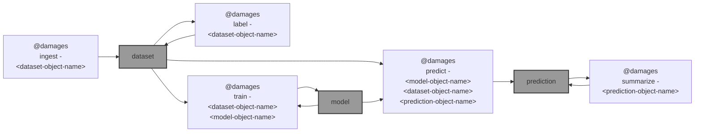

# 🌐 `@damages`: Satellite imagery damage assessment workflow

🌐 `@damages` is a work in progress on [Satellite imagery damage assessment workflow](https://github.com/microsoft/building-damage-assessment/blob/main/SATELLITE_WORKFLOW.md) ([reference](https://www.satellite-image-deep-learning.com/p/building-damage-assessment)).



## Status

`@damages train`

In [`fine_tune.py`](https://github.com/microsoft/building-damage-assessment/blob/main/fine_tune.py) `num_workers=24` is not satisfied even on `ml-g4dn-xlarge` and `ml-g4dn-2xlarge`, changed to `6`. On both machines on Sagemaker, `fine_tune.py` has not converged after 3+ hours [dev notes](https://arash-kamangir.medium.com/%EF%B8%8F-conversations-with-ai-338-c636f0866a11).

`@damages ingest` provides assess to [Maxar's Open Data program](https://www.maxar.com/open-data/). Will refactor `@maxar ingest`.

question: is the imagery uploaded to azure for labelling? can this be ignored if labelling is done through QGIS?

- [ ] remove `predict`.
- [ ] validate `@damage summarize`.
- [ ] digest,
    - https://www.satellite-image-deep-learning.com/p/building-damage-assessment
    - https://www.linkedin.com/posts/jlavista_our-hearts-go-out-to-everyone-affected-by-activity-7283234111329128449-sHiI?utm_source=share&utm_medium=member_desktop
    - https://www.linkedin.com/posts/maxar-technologies-ltd_weve-been-closely-monitoring-the-historic-ugcPost-7283203547020574722-fqMn?utm_source=share&utm_medium=member_desktop
    - https://www.linkedin.com/posts/jlavista_we-continue-to-analyze-satellite-data-related-activity-7283693403727392768-XI02?utm_source=share&utm_medium=member_desktop
    - https://github.com/microsoft/building-damage-assessment/blob/main/DPM_WORKFLOW.md SAR

more ToDos listed ⬇️

---

purpose: ... given post-disaster imagery ... to identify whether each known building footprint ... is damaged, and to what extent ... approach: ... fine-tune a pre-trained semantic segmentation model on a small amount of labeled data collected in the AOI itself ... model ... then ... generates per-pixel prediction over the entire imagery, which can then be summarized at the building level

1) [ingest and labeling](#1-ingest-and-labelling)
2) [train and inference](#2-train-and-inference)
3) [summarization](#3-summarization)

## 1. ingest and labelling

Includes ... acquisition ... of post disaster imagery from [Maxar's Open Data program](https://www.maxar.com/open-data/) (other options: Sentinel-2, Planet, and NOAA), and label generation. 

To see the list of all events,

```bash
@damages ingest list events
```
```bash
⚙️  aws s3 ls --no-sign-request s3://maxar-opendata/events/
                           PRE BayofBengal-Cyclone-Mocha-May-23/
                           PRE Belize-Wildfires-June24/
                           PRE Brazil-Flooding-May24/
...
```

To see the list of acquisitions for `<event>`,

```bash
@damages ingest list \
    event=Maui-Hawaii-fires-Aug-23 04/
```
```bash
⚙️  aws s3 ls --no-sign-request s3://maxar-opendata/events/Maui-Hawaii-fires-Aug-23/ard/04/
                           PRE 122000303330/
                           PRE 122000303331/
                           PRE 122000303332/
                           PRE 122000303333/
                           PRE 122000312220/
                           PRE 122000312222/
                           PRE 122000312223/
...
```

Here, we use the [Maui wildfires in August, 2023](https://radiantearth.github.io/stac-browser/#/external/maxar-opendata.s3.amazonaws.com/events/Maui-Hawaii-fires-Aug-23/collection.json). We download the imagery captured over Lahaina on 8/12/2023, and merge the files into a single cloud optimized GeoTIFF (COG).

- [ ] `@damages ingest` += `count` <- how many tifs to download and merge 🚧 + proper handling of `event_name` 🚧 

- [ ] `@damages label` += proper handling of `event_name` 🚧 


```bash
ingest_and_label() {
    local options=$1
    local event_name=$(@option "$options" event Maui-Hawaii-fires-Aug-23)

    @select $event_name-ingest-$(@@timestamp)

    @damages ingest event=$event_name,~upload .

    @damages label ~upload .

    @wait "+= .qgz?"

    @upload - .

    @publish tar .
}

ingest_and_label
``` 

## 2. train and inference

🔥

```bash
train() {
    local options=$1
    local show_tensorboard=$(@option::int "$options" tensorboard 0)

    @select $DAMAGES_TEST_DATASET_OBJECT_NAME

    local event_name=$(@mlflow tags get . --tag event)
    @log "event: $event_name"

    @select $event_name-model-$(@@timestamp)

    @damages train - .. .

    [[ "$show_tensorboard" == 1 ]] &&
        @damages tensorboard - .
}

train ~tensorboard
```

|   |   |   |   |   |
| --- | --- | --- | --- | --- |
| `ingest` | `label` | `train` | `predict` | `summarize` |
| [`Maui-Hawaii-fires-Aug-23-ingest-2025-01-10-qqJqhm`](https://kamangir-public.s3.ca-central-1.amazonaws.com/Maui-Hawaii-fires-Aug-23-damage-2025-01-09-GgnjQC.tar.gz) |  |  |  |  |
|  |  |  |  |  |

<details>
<summary>pending ...</summary>


## 3. summarization
To summarize results at the building level, download building footprints from OSM, Google, or Microsoft using the `download_building_footprints.py` command, for example:

```
python download_building_footprints.py --source microsoft --input_fn data/demo/raw/maxar_lahaina_8_12_2023-visual.tif --output_dir data/demo/buildings/ --country_alpha2_iso_code US
```

Merge inference results with downloaded building footprints with the following command:

```
python merge_with_building_footprints.py --footprints_fn data/demo/buildings/US_microsoft_buildings_footprints.gpkg --predictions_fn experiments/maui_demo_0/outputs/maxar_lahaina_8_12_2023-visual_predictions.tif --output_fn experiments/maui_demo_0/outputs/maxar_lahaina_8_12_2023-visual_predictions.gpkg
```

This will calculate the percentage of each building that is predicted to be damaged and save the results as a geopackage.

The final output looks like this:


<details>
