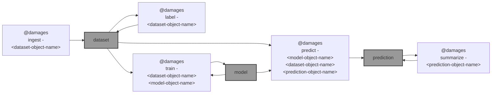

# 🌐 `@damages`: Satellite imagery damage assessment workflow

🌐 `@damages` is a work in progress on [Satellite imagery damage assessment workflow](https://github.com/microsoft/building-damage-assessment/blob/main/SATELLITE_WORKFLOW.md) ([reference](https://www.satellite-image-deep-learning.com/p/building-damage-assessment)).



---

purpose: ... given post-disaster imagery ... to identify whether each known building footprint ... is damaged, and to what extent ... approach: ... fine-tune a pre-trained semantic segmentation model on a small amount of labeled data collected in the AOI itself ... model ... then ... generates per-pixel prediction over the entire imagery, which can then be summarized at the building level

1) [ingest and labeling](#1-ingest-and-labelling)
2) [train and inference](#2-train-and-inference)
3) [summarization](#3-summarization)

## 1. ingest and labelling

Includes ... acquisition ... of post disaster imagery from [Maxar's Open Data program](https://www.maxar.com/open-data/) (other options: Sentinel-2, Planet, and NOAA), and label generation. 

To see the list of all events,

```bash
@damages ingest list events
```
```bash
⚙️  aws s3 ls --no-sign-request s3://maxar-opendata/events/
                           PRE BayofBengal-Cyclone-Mocha-May-23/
                           PRE Belize-Wildfires-June24/
                           PRE Brazil-Flooding-May24/
...
```

To see the list of acquisitions for `<event>`,

```bash
@damages ingest list \
    event=Maui-Hawaii-fires-Aug-23 04/
```
```bash
⚙️  aws s3 ls --no-sign-request s3://maxar-opendata/events/Maui-Hawaii-fires-Aug-23/ard/04/
                           PRE 122000303330/
                           PRE 122000303331/
                           PRE 122000303332/
                           PRE 122000303333/
                           PRE 122000312220/
                           PRE 122000312222/
                           PRE 122000312223/
...
```

Here, we use the [Maui wildfires in August, 2023](https://radiantearth.github.io/stac-browser/#/external/maxar-opendata.s3.amazonaws.com/events/Maui-Hawaii-fires-Aug-23/collection.json). We download the imagery captured over Lahaina on 8/12/2023, and merge the files into a single cloud optimized GeoTIFF (COG).

- [ ] `@damages ingest` += `count` <- how many tifs to download and merge 🚧 + proper handling of `event_name` 🚧 

- [ ] `@damages label` += proper handling of `event_name` 🚧 


```bash
ingest_and_label() {
    local options=$1
    local event_name=$(@option "$options" event Maui-Hawaii-fires-Aug-23)

    @select $event_name-ingest-$(@@timestamp)

    @damages ingest event=$event_name,~upload .

    @damages label ~upload .

    @wait "+= .qgz?"

    @upload - .

    @publish tar .
}

ingest_and_label
``` 

🔥

```bash
train() {
    @select Maui-Hawaii-fires-Aug-23-ingest-2025-01-10-qqJqhm

    local event_name=$(@mlflow tags get . --tag event)
    @log "event: $event_name"

    @select $event_name-model-$(@@timestamp)

    @damages train - .. .
}

train
```

|   |   |   |   |   |
| --- | --- | --- | --- | --- |
| `ingest` | `label` | `train` | `predict` | `summarize` |
| [`Maui-Hawaii-fires-Aug-23-ingest-2025-01-10-qqJqhm`](https://kamangir-public.s3.ca-central-1.amazonaws.com/Maui-Hawaii-fires-Aug-23-damage-2025-01-09-GgnjQC.tar.gz) | [`Maui-Hawaii-fires-Aug-23-ingest-2025-01-10-qqJqhm`](https://kamangir-public.s3.ca-central-1.amazonaws.com/Maui-Hawaii-fires-Aug-23-ingest-2025-01-10-qqJqhm.tar.gz) |  |  |  |
|  |  |  |  |  |

🔥

### Step 1.2
`project_setup.py` should create a link to a [satellite-imagery-labeling-tool](https://github.com/microsoft/satellite-imagery-labeling-tool/) instance with the post-disaster imagery visible. There is detailed documentation on how to setup and use the annotation tool [here](https://github.com/microsoft/satellite-imagery-labeling-tool/tree/main/docs). The next step is to create annotations using this tool, download those annotations, and save in the location pointed to be `labels.fn` in the config file.

## 2. train and inference

The model training and inference steps are based on config files. If you opted to skip the previous step, we have provided example labels for the demo in `data/demo/labels/` and a default config file that uses these labels in `configs/example_config.yml`. After setting up the config file, the following commands will create masks from the GeoJSON labels, fine-tune a model using the imagery and masks, and run inference with that model over the entire scene:
```
python create_masks.py --config configs/example_config.yml
python fine_tune.py --config configs/example_config.yml
python inference.py --config configs/example_config.yml
```

**OR**, more simply:
```
python run_workflow.py --config configs/example_config.yml
```


More specifically, the `create_masks.py` script will create a new directory in based on the **experiment_dir** key in the config file, with the training images in `images/`, the rasterized version of the labels in `masks/`, and a copy of the original labels in `labels/`. Next, the `fine_tune.py` script will use the `images/` and `masks/` directory to fine-tune a semantic segmentation model, saving model checkpoints in `checkpoints/` and TensorBoard logs to the directory specified by the **training.log_dir** key in the config file. Finally, `inference.py` will create predictions over the entire input image (using the latest model checkpoint) and save the results to the `outputs/` directory.

You can use tensorboard to monitor training:
```
tensorboard --logdir logs/maui_demo_0/ --port 8889
```

In particular, the "Images" tab in tensorboard will show examples of the input imagery, target mask, and model predictions. See the following figure for an example:


If, after 20-30 epochs of training, the model results do not look reasonable, then we advise labeling more examples of the three classes (taking into account the mistakes that the model is making), creating a copy of the config file pointing to the updated GeoJSON, and re-running the `create_masks.py`, `fine_tune.py`, and `inference.py` scripts. It is also helpful to intermittently run inference with the latest checkpoint while the model is training to see if the results are useful.

The following figures show imagery and the resulting predictions after 8 epochs of training with the example labels (green is the "Building" class and red is the "Damaged Building" class):


## 3. summarization
To summarize results at the building level, download building footprints from OSM, Google, or Microsoft using the `download_building_footprints.py` command, for example:

```
python download_building_footprints.py --source microsoft --input_fn data/demo/raw/maxar_lahaina_8_12_2023-visual.tif --output_dir data/demo/buildings/ --country_alpha2_iso_code US
```

Merge inference results with downloaded building footprints with the following command:

```
python merge_with_building_footprints.py --footprints_fn data/demo/buildings/US_microsoft_buildings_footprints.gpkg --predictions_fn experiments/maui_demo_0/outputs/maxar_lahaina_8_12_2023-visual_predictions.tif --output_fn experiments/maui_demo_0/outputs/maxar_lahaina_8_12_2023-visual_predictions.gpkg
```

This will calculate the percentage of each building that is predicted to be damaged and save the results as a geopackage.

The final output looks like this:


