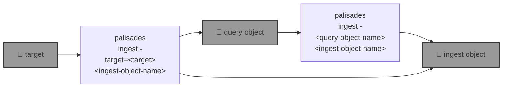

# 🧑🏽‍🚒 `palisades`: Post-disaster Land Cover Classification

🧑🏽‍🚒 `palisades` is going to to segment post-disaster multispectral acquisitions from [Maxar Open Data](https://github.com/kamangir/blue-geo/tree/main/blue_geo/catalog/maxar_open_data) into land cover classes such as burned, fuel, and water, first using [pixel-based algo](https://xgboost.readthedocs.io/en/stable/), and then a [SemSeg](https://github.com/kamangir/roofAI).



```bash
palisades help
```

--help-- palisades ingest help

## Status 🔥

🔥
