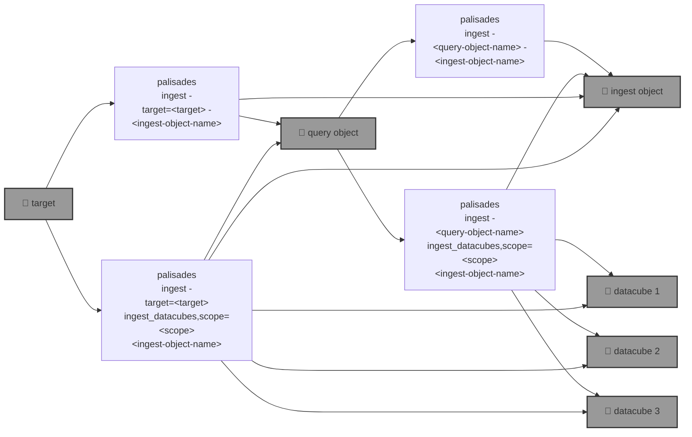

# 🧑🏽‍🚒 `palisades`: Post-disaster Land Cover Classification

🧑🏽‍🚒 `palisades` is going to to segment post-disaster multispectral acquisitions from [Maxar Open Data](https://github.com/kamangir/blue-geo/tree/main/blue_geo/catalog/maxar_open_data) into land cover classes such as burned, fuel, and water, first using [pixel-based algo](https://xgboost.readthedocs.io/en/stable/), and then a [SemSeg](https://github.com/kamangir/roofAI).



```bash
palisades help
```

```bash
palisades \
	ingest \
	[~download,dryrun,upload] \
	[target=<target> | <query-object-name>] \
	[ingest_datacubes,~copy_template,dryrun,overwrite,scope=<scope>,upload] \
	[-|<ingest-object-name>]
 . ingest <target>.
   target: Brown-Mountain-Truck-Trail | Brown-Mountain-Truck-Trail-all | Brown-Mountain-Truck-Trail-test | Palisades-Maxar | Palisades-Maxar-test
   scope: all + metadata + raster + rgb + rgbx + <.jp2> + <.tif> + <.tiff>
      all: ALL files.
      metadata (default): any < 1 MB.
      raster: all raster.
      rgb: rgb.
      rgbx: rgb and what is needed to build rgb.
      <suffix>: any *<suffix>.
```

## Status 🔥

```bash
palisades ingest ~upload \
	target=Palisades-Maxar --
```

🔥
