# 🧑🏽‍🚒 `palisades`: Post-disaster Land Cover Classification

🧑🏽‍🚒 `palisades` generates post-disaster land cover classification by applying a [SemSeg](https://github.com/kamangir/roofAI) on [Maxar Open Data](https://github.com/kamangir/blue-geo/tree/main/blue_geo/catalog/maxar_open_data) acquisitions.

```mermaid
graph LR
    palisades_ingest_query_ingest["palisades<br>ingest -<br>&lt;query-object-name&gt;<br>scope=&lt;scope&gt;"]

    palisades_ingest_target["palisades<br>ingest -<br>target=&lt;target&gt;<br>~ingest_datacubes"]

    palisades_ingest_target_ingest["palisades<br>ingest -<br>target=&lt;target&gt;<br>scope=&lt;scope&gt;"]

    target["🎯 target"]:::folder
    query_object["📂 query object"]:::folder
    datacube_1["🧊 datacube 1"]:::folder
    datacube_2["🧊 datacube 2"]:::folder
    datacube_3["🧊 datacube 3"]:::folder

    query_object --> palisades_ingest_query_ingest
    palisades_ingest_query_ingest --> datacube_1
    palisades_ingest_query_ingest --> datacube_2
    palisades_ingest_query_ingest --> datacube_3

    target --> palisades_ingest_target
    palisades_ingest_target --> query_object

    target --> palisades_ingest_target_ingest
    palisades_ingest_target_ingest --> query_object
    palisades_ingest_target_ingest --> datacube_1
    palisades_ingest_target_ingest --> datacube_2
    palisades_ingest_target_ingest --> datacube_3

    classDef folder fill:#999,stroke:#333,stroke-width:2px;
```



<details>
<summary>palisades help</summary>

```bash
palisades \
	ingest \
	[~download,dryrun,upload] \
	[target=<target> | <query-object-name>] \
	[~ingest_datacubes | ~copy_template,dryrun,overwrite,scope=<scope>,upload]
 . ingest <target>.
   target: Brown-Mountain-Truck-Trail | Brown-Mountain-Truck-Trail-all | Brown-Mountain-Truck-Trail-test | Palisades-Maxar | Palisades-Maxar-test
   scope: all + metadata + raster + rgb + rgbx + <.jp2> + <.tif> + <.tiff>
      all: ALL files.
      metadata (default): any < 1 MB.
      raster: all raster.
      rgb: rgb.
      rgbx: rgb and what is needed to build rgb.
      <suffix>: any *<suffix>.
```

</details>


## round one - step by step

1️⃣ running a query,

```bash
palisades ingest ~upload \
	target=Palisades-Maxar  \
	~ingest_datacubes
```

```bash
$PALISADES_QUERY_OBJECT_PALISADES_MAXAR
```

<details>
<summary>details</summary>

```yaml
datacube_id:
- datacube-maxar_open_data-WildFires-LosAngeles-Jan-2025-11-031311102212-103001010B9A1B00
- datacube-maxar_open_data-WildFires-LosAngeles-Jan-2025-11-031311102213-103001010B9A1B00
- datacube-maxar_open_data-WildFires-LosAngeles-Jan-2025-11-031311102212-103001010C7D2D00
- datacube-maxar_open_data-WildFires-LosAngeles-Jan-2025-11-031311102213-103001010C7D2D00
- datacube-maxar_open_data-WildFires-LosAngeles-Jan-2025-11-031311102212-10400100A06B8000
- datacube-maxar_open_data-WildFires-LosAngeles-Jan-2025-11-031311102213-10400100A06B8000
- datacube-maxar_open_data-WildFires-LosAngeles-Jan-2025-11-031311102212-10400100A0B73800
- datacube-maxar_open_data-WildFires-LosAngeles-Jan-2025-11-031311102213-10400100A0B73800
- datacube-maxar_open_data-WildFires-LosAngeles-Jan-2025-11-031311102212-10400100A1AFE700
- datacube-maxar_open_data-WildFires-LosAngeles-Jan-2025-11-031311102213-10400100A1AFE700
```

Also ingest `Palisades-Maxar-test` into `$PALISADES_QUERY_OBJECT_PALISADES_MAXAR_TEST`.

```yaml
datacube_id:
- datacube-maxar_open_data-WildFires-LosAngeles-Jan-2025-11-031311102212-103001010B9A1B00
- datacube-maxar_open_data-WildFires-LosAngeles-Jan-2025-11-031311102213-103001010B9A1B00
```

</details>

2️⃣ ingesting the datacubes,

```bash
palisades ingest upload \
	$PALISADES_QUERY_OBJECT_PALISADES_MAXAR_TEST \
	scope=rgb,upload
```

3️⃣ labelling the datacubes,

🔥

## round one - one shot 🚧

🚧

```bash
palisades ingest upload \
	target=Palisades-Maxar \
	scope=rgb,upload
```
