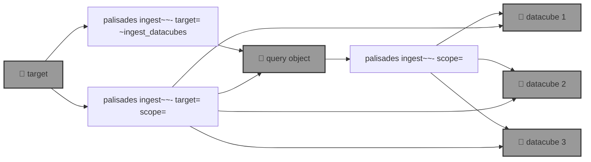

# 🧑🏽‍🚒 `palisades`: Post-disaster Land Cover Classification

🧑🏽‍🚒 `palisades` generates post-disaster land cover classification by applying a [SemSeg](https://github.com/kamangir/roofAI) on [Maxar Open Data](https://github.com/kamangir/blue-geo/tree/main/blue_geo/catalog/maxar_open_data) acquisitions.



<details>
<summary>palisades help</summary>

--help-- palisades ingest help

</details>


## round one - step by step

1️⃣ running a query,

```bash
palisades ingest ~upload \
	target=Palisades-Maxar  \
	~ingest_datacubes
```

```bash
$PALISADES_QUERY_OBJECT_PALISADES_MAXAR
```

<details>
<summary>details</summary>

```yaml
datacube_id:
- datacube-maxar_open_data-WildFires-LosAngeles-Jan-2025-11-031311102212-103001010B9A1B00
- datacube-maxar_open_data-WildFires-LosAngeles-Jan-2025-11-031311102213-103001010B9A1B00
- datacube-maxar_open_data-WildFires-LosAngeles-Jan-2025-11-031311102212-103001010C7D2D00
- datacube-maxar_open_data-WildFires-LosAngeles-Jan-2025-11-031311102213-103001010C7D2D00
- datacube-maxar_open_data-WildFires-LosAngeles-Jan-2025-11-031311102212-10400100A06B8000
- datacube-maxar_open_data-WildFires-LosAngeles-Jan-2025-11-031311102213-10400100A06B8000
- datacube-maxar_open_data-WildFires-LosAngeles-Jan-2025-11-031311102212-10400100A0B73800
- datacube-maxar_open_data-WildFires-LosAngeles-Jan-2025-11-031311102213-10400100A0B73800
- datacube-maxar_open_data-WildFires-LosAngeles-Jan-2025-11-031311102212-10400100A1AFE700
- datacube-maxar_open_data-WildFires-LosAngeles-Jan-2025-11-031311102213-10400100A1AFE700
```

Also ingest `Palisades-Maxar-test` into `$PALISADES_QUERY_OBJECT_PALISADES_MAXAR_TEST`.

```yaml
datacube_id:
- datacube-maxar_open_data-WildFires-LosAngeles-Jan-2025-11-031311102212-103001010B9A1B00
- datacube-maxar_open_data-WildFires-LosAngeles-Jan-2025-11-031311102213-103001010B9A1B00
```

</details>

2️⃣ ingesting the datacubes,

```bash
palisades ingest upload \
	$PALISADES_QUERY_OBJECT_PALISADES_MAXAR_TEST \
	scope=rgb,upload
```

3️⃣ labelling the datacubes,

🔥

## round two - single shot 🚧

🚧

```bash
palisades ingest upload \
	target=Palisades-Maxar \
	scope=rgb,upload
```