# 🧑🏽‍🚒 `palisades`: Post-disaster Land Cover Classification

🧑🏽‍🚒 `palisades` generates post-disaster land cover classification by applying a [SemSeg](https://github.com/kamangir/roofAI) on [Maxar Open Data](https://github.com/kamangir/blue-geo/tree/main/blue_geo/catalog/maxar_open_data) acquisitions.

```mermaid
graph LR
    palisades_ingest_query_ingest["palisades ingest~~- <query-object-name> scope=<scope>"]

    palisades_ingest_target["palisades ingest~~- target=<target> ~ingest_datacubes"]

    palisades_ingest_target_ingest["palisades ingest~~- target=<target> scope=<scope>"]

    palisades_label["palisades label offset=<offset>~~- <query-object-name>"]

    target["🎯 target"]:::folder
    query_object["📂 query object"]:::folder
    datacube_1["🧊 datacube 1"]:::folder
    datacube_2["🧊 datacube 2"]:::folder
    datacube_3["🧊 datacube 3"]:::folder

    query_object --> datacube_1
    query_object --> datacube_2
    query_object --> datacube_3

    query_object --> palisades_ingest_query_ingest
    palisades_ingest_query_ingest --> datacube_1
    palisades_ingest_query_ingest --> datacube_2
    palisades_ingest_query_ingest --> datacube_3

    target --> palisades_ingest_target
    palisades_ingest_target --> query_object

    target --> palisades_ingest_target_ingest
    palisades_ingest_target_ingest --> query_object
    palisades_ingest_target_ingest --> datacube_1
    palisades_ingest_target_ingest --> datacube_2
    palisades_ingest_target_ingest --> datacube_3

    query_object --> palisades_label
    palisades_label --> datacube_1

    classDef folder fill:#999,stroke:#333,stroke-width:2px;
```



<details>
<summary>palisades help</summary>

--help-- palisades ingest help

</details>


## round one - step by step

1️⃣ running a query,

```bash
palisades ingest ~upload \
	target=Palisades-Maxar  \
	~ingest_datacubes
```

```bash
$PALISADES_QUERY_OBJECT_PALISADES_MAXAR
```

<details>
<summary>details</summary>

```yaml
datacube_id:
- datacube-maxar_open_data-WildFires-LosAngeles-Jan-2025-11-031311102212-103001010B9A1B00
- datacube-maxar_open_data-WildFires-LosAngeles-Jan-2025-11-031311102213-103001010B9A1B00
- datacube-maxar_open_data-WildFires-LosAngeles-Jan-2025-11-031311102212-103001010C7D2D00
- datacube-maxar_open_data-WildFires-LosAngeles-Jan-2025-11-031311102213-103001010C7D2D00
- datacube-maxar_open_data-WildFires-LosAngeles-Jan-2025-11-031311102212-10400100A06B8000
- datacube-maxar_open_data-WildFires-LosAngeles-Jan-2025-11-031311102213-10400100A06B8000
- datacube-maxar_open_data-WildFires-LosAngeles-Jan-2025-11-031311102212-10400100A0B73800
- datacube-maxar_open_data-WildFires-LosAngeles-Jan-2025-11-031311102213-10400100A0B73800
- datacube-maxar_open_data-WildFires-LosAngeles-Jan-2025-11-031311102212-10400100A1AFE700
- datacube-maxar_open_data-WildFires-LosAngeles-Jan-2025-11-031311102213-10400100A1AFE700
```

Also ingested `Palisades-Maxar-test` into `$PALISADES_QUERY_OBJECT_PALISADES_MAXAR_TEST`.

```yaml
datacube_id:
- datacube-maxar_open_data-WildFires-LosAngeles-Jan-2025-11-031311102212-103001010B9A1B00
- datacube-maxar_open_data-WildFires-LosAngeles-Jan-2025-11-031311102213-103001010B9A1B00
```

</details>

2️⃣ ingesting the datacubes,

```bash
palisades ingest upload \
	$PALISADES_QUERY_OBJECT_PALISADES_MAXAR_TEST \
	scope=rgb,upload
```

3️⃣ labelling one datacube,

```bash
@select $BLUE_GEO_PALISADES_TEST_DATACUBE
@datacube ingest scope=rgb .
@datacube label - .
```

```python
datacube.label
```


4️⃣ creating a a dataset,

```bash
palisades-dataset-v1
```

```yaml
datacube_id:
- datacube-maxar_open_data-WildFires-LosAngeles-Jan-2025-11-031311102213-103001010B9A1B00
```

```bash
palisades label \
	offset=0 \
	upload \
	palisades-dataset-v1
```


```yaml
blue_geo.datacube.label.rasterize.rasterize_the_label:
  counts:
    affected: 1178601
    unaffected: 1412780
  label_count: 51
  label_filename: label.shp
  list_of_classes:
  - affected
  - unaffected
  reference_filename: 11-031311102213-103001010B9A1B00-103001010B9A1B00-visual.tif
```

5️⃣ reviewing the dataset,

🔥

6️⃣ ingesting from the dataset,

🚧

7️⃣ train,

🚧

## round two - single shot 🚧

🚧

```bash
palisades ingest upload \
	target=Palisades-Maxar \
	scope=rgb,upload
```