# 🧑🏽‍🚒 `palisades`: Post-disaster Land Cover Classification

🧑🏽‍🚒 `palisades` is going to to segment post-disaster multispectral acquisitions from [Maxar Open Data](https://github.com/kamangir/blue-geo/tree/main/blue_geo/catalog/maxar_open_data) into land cover classes such as burned, fuel, and water, first using [pixel-based algo](https://xgboost.readthedocs.io/en/stable/), and then a [SemSeg](https://github.com/kamangir/roofAI).

```mermaid
graph LR
    palisades_ingest_query["palisades ingest~- <query-object-name>~- <ingest-object-name>"]
    palisades_ingest_query_ingest["palisades ingest~- <query-object-name> ingest_datacubes,scope=<scope> <ingest-object-name>"]

    palisades_ingest_target["palisades ingest~- target=<target>~- <ingest-object-name>"]
    palisades_ingest_target_ingest["palisades ingest~- target=<target> ingest_datacubes,scope=<scope> <ingest-object-name>"]

    target["🎯 target"]:::folder
    query_object["📂 query object"]:::folder
    ingest_object["📂 ingest object"]:::folder
    datacube_1["🧊 datacube 1"]:::folder
    datacube_2["🧊 datacube 2"]:::folder
    datacube_3["🧊 datacube 3"]:::folder

    query_object --> palisades_ingest_query
    palisades_ingest_query --> ingest_object

    query_object --> palisades_ingest_query_ingest
    palisades_ingest_query_ingest --> datacube_1
    palisades_ingest_query_ingest --> datacube_2
    palisades_ingest_query_ingest --> datacube_3
    palisades_ingest_query_ingest --> ingest_object

    target --> palisades_ingest_target
    palisades_ingest_target --> query_object
    palisades_ingest_target --> ingest_object

    target --> palisades_ingest_target_ingest
    palisades_ingest_target_ingest --> query_object
    palisades_ingest_target_ingest --> datacube_1
    palisades_ingest_target_ingest --> datacube_2
    palisades_ingest_target_ingest --> datacube_3
    palisades_ingest_target_ingest --> ingest_object

    classDef folder fill:#999,stroke:#333,stroke-width:2px;
```



<details>
<summary>palisades help</summary>

--help-- palisades ingest help

</details>

## Status 🔥

1️⃣ running a query,

```bash
palisades ingest ~upload \
	target=Palisades-Maxar --
```

objects:
- `$PALISADES_TEST_QUERY_OBJECT_NAME`
- `$PALISADES_TEST_QUERY_OBJECT_NAME_2D` - 2 datacubes.

<details>
<summary>metadata.yaml</summary>

```yaml
datacube_id:
- datacube-maxar_open_data-WildFires-LosAngeles-Jan-2025-11-031311102212-103001010B9A1B00
- datacube-maxar_open_data-WildFires-LosAngeles-Jan-2025-11-031311102213-103001010B9A1B00
- datacube-maxar_open_data-WildFires-LosAngeles-Jan-2025-11-031311102212-103001010C7D2D00
- datacube-maxar_open_data-WildFires-LosAngeles-Jan-2025-11-031311102213-103001010C7D2D00
- datacube-maxar_open_data-WildFires-LosAngeles-Jan-2025-11-031311102212-10400100A06B8000
- datacube-maxar_open_data-WildFires-LosAngeles-Jan-2025-11-031311102213-10400100A06B8000
- datacube-maxar_open_data-WildFires-LosAngeles-Jan-2025-11-031311102212-10400100A0B73800
- datacube-maxar_open_data-WildFires-LosAngeles-Jan-2025-11-031311102213-10400100A0B73800
- datacube-maxar_open_data-WildFires-LosAngeles-Jan-2025-11-031311102212-10400100A1AFE700
- datacube-maxar_open_data-WildFires-LosAngeles-Jan-2025-11-031311102213-10400100A1AFE700
```

</details>

2️⃣ ingesting the datacubes,

```bash
palisades ingest upload] \
	$PALISADES_TEST_QUERY_OBJECT_NAME_2D \
	ingest_datacubes,scope=rgb,upload
```

🔥