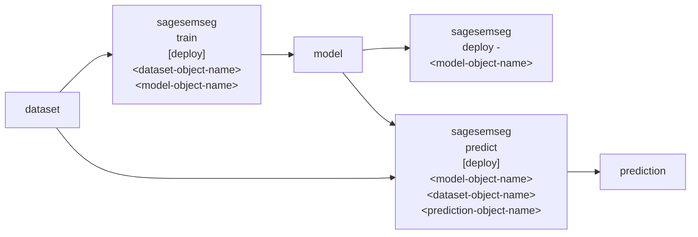

# 🌀 `sagesemseg`: SemSeg on SageMaker

🌀 `sagesemseg` is A SemSeg (Semantic Segmenter) trained and deployed on AWS Sagemaker, based on [Amazon SageMaker Semantic Segmentation Algorithm](https://github.com/aws/amazon-sagemaker-examples/blob/main/introduction_to_amazon_algorithms/semantic_segmentation_pascalvoc/semantic_segmentation_pascalvoc.ipynb).




## Status ⏸️

[train](../../notebooks/sagesemseg/semantic_segmentation_pascalvoc-v9-train.ipynb), [deploy](../../notebooks/sagesemseg/semantic_segmentation_pascalvoc-v11-deploy.ipynb), and [predict](../../notebooks/sagesemseg/semantic_segmentation_pascalvoc-v11-predict.ipynb) are done through notebooks.

Two completed jobs to deploy,

- `$SAGESEMSEG_COMPLETED_JOB_pascal_voc_v1_debug_v2`
- `$SAGESEMSEG_COMPLETED_JOB_pascal_voc_v1_full_v2` ⭐️  larger dataset, use for dev.

`$SAGESEMSEG_COMPLETED_JOB_<object-name>` is trained on `<object-name>`.

- Advantage: Deployment on Sagemaker is included: no GPU set-up.
- Disadvantages:
    - `3 x uint8` ⛔️ one chip at a time ⛔️ 10s per chip ⛔️
    - limitations on instance allocation make testing harder.


🔥

- [ ] add `sagesemseg.sh` to [`.abcli`](../.abcli) -> refactor [`.abcli/sagesemseg`](../.abcli/sagesemseg/) from legacy script format.
- [ ] refactor [`sagesemseg_train.sh`](../.abcli/tests/sagesemseg_train.sh).
- 🔥

consume 🔥

# Semantic Segmentation on AWS Sagemaker

Based on [Semantic Segmentation on AWS Sagemaker](https://github.com/aws/amazon-sagemaker-examples/blob/main/introduction_to_amazon_algorithms/semantic_segmentation_pascalvoc/semantic_segmentation_pascalvoc.ipynb), uses [roofAI.semseg.sagemaker](https://github.com/kamangir/roofAI/tree/main/roofAI/semseg/sagemaker).

```bash
 > sagesemseg help
sagesemseg cache_dataset \
	[dataset=pascal-voc,suffix=<v1>,rm]
 . cache dataset.
sagesemseg train \
	[dryrun,~upload] \
	[test|<dataset-object-name>] \
	[-|<model-object-name>] \
	[--deploy 0] \
	[--delete_endpoint 0] \
	[--epochs 10] \
	[--instance_type ml.p3.2xlarge]
 . <dataset-object-name> -train-> <model-object-name>.
sagesemseg upload_dataset \
	[dataset=pascal-voc,suffix=<v1>] \
	[dryrun,suffix=<v1>] \
	[--count <count>]
 . upload dataset to SageMaker for training.
```

🔥

-> [`roofAI`](https://github.com/kamangir/roofAI).

## future 🚧

```bash
@conda activate sagemaker

@select roofAI-sagemaker-dataset-AIRS-1000-v4

roofAI dataset ingest \
    source=AIRS,target=sagemaker,upload . \
    --test_count 0 \
    --train_count 1000 \
    --val_count 200

@select roofAI-sagemaker-semseg-AIRS-1000-v4

sagesemseg train - .. . \
    --instance_type ml.g4dn.2xlarge
```
