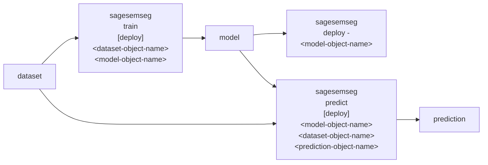

# 🌀 `sagesemseg`: SemSeg on SageMaker

🌀 `sagesemseg` is A SemSeg (Semantic Segmenter) trained and deployed on AWS Sagemaker, based on [Amazon SageMaker Semantic Segmentation Algorithm](https://github.com/aws/amazon-sagemaker-examples/blob/main/introduction_to_amazon_algorithms/semantic_segmentation_pascalvoc/semantic_segmentation_pascalvoc.ipynb).



## Status ⏸️

[train](../../notebooks/sagesemseg/semantic_segmentation_pascalvoc-v9-train.ipynb), [deploy](../../notebooks/sagesemseg/semantic_segmentation_pascalvoc-v11-deploy.ipynb), and [predict](../../notebooks/sagesemseg/semantic_segmentation_pascalvoc-v11-predict.ipynb) are done through notebooks.

Two completed jobs to deploy,

- `$SAGESEMSEG_COMPLETED_JOB_pascal_voc_v1_debug_v2`
- `$SAGESEMSEG_COMPLETED_JOB_pascal_voc_v1_full_v2` ⭐️  larger dataset, use for dev.

`$SAGESEMSEG_COMPLETED_JOB_<object-name>` is trained on `<object-name>`.

- Advantage: Deployment on Sagemaker is included: no GPU set-up.
- Disadvantages:
    - `3 x uint8` ⛔️ one chip at a time ⛔️ 10s per chip ⛔️
    - limitations on instance allocation make testing harder.  ⛔️


- [ ] add `sagesemseg.sh` to [`.abcli`](../.abcli) -> refactor [`.abcli/sagesemseg`](../.abcli/sagesemseg/) from legacy script format.
- [ ] refactor [`sagesemseg_train.sh`](../.abcli/tests/sagesemseg_train.sh).
- [ ] digest,
```bash
@conda activate sagemaker

@select roofAI-sagemaker-dataset-AIRS-1000-v4

roofAI dataset ingest \
    source=AIRS,target=sagemaker,upload . \
    --test_count 0 \
    --train_count 1000 \
    --val_count 200

@select roofAI-sagemaker-semseg-AIRS-1000-v4

sagesemseg train - .. . \
    --instance_type ml.g4dn.2xlarge
```

-> [`roofAI`](https://github.com/kamangir/roofAI).